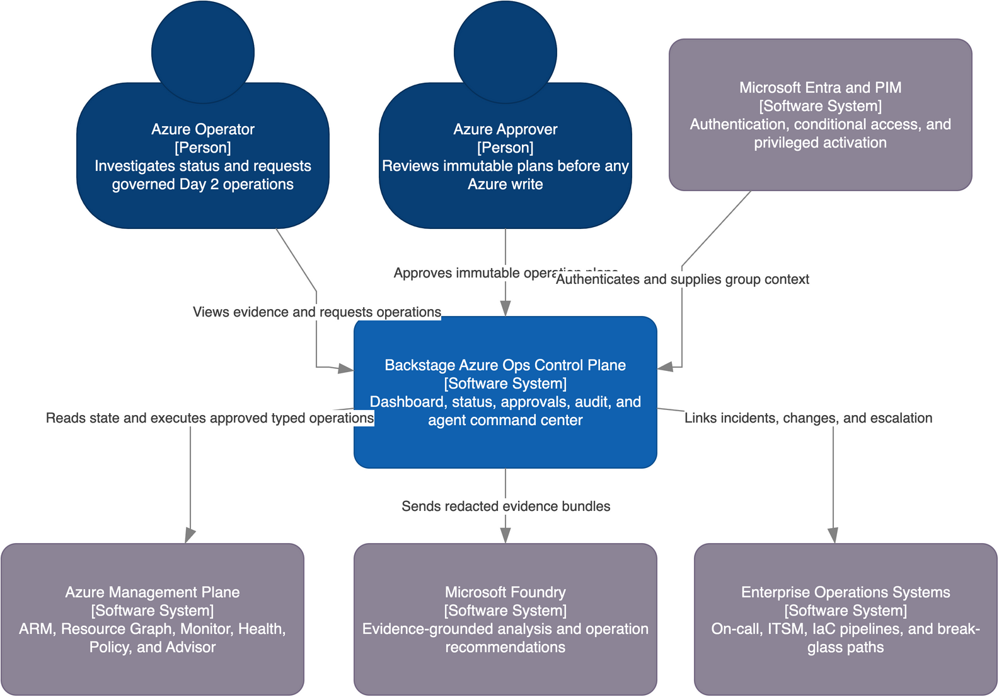

# Azure operations control plane

Backstage can provide a unified experience for Azure Day 2 operations when it
is positioned as an _operations experience and governance plane_. Azure remains
the authoritative management and telemetry plane.

The target experience combines:

- A cross-subscription **Dashboard** for inventory, health, alerts, compliance,
  and recommended work.
- A **Status** view for incidents, affected resources, owners, recent changes,
  and operational procedures.
- An **Agent Command Center** for evidence-grounded analysis, deterministic
  operation plans, approval, progress, and audit.

:::caution

Microsoft Foundry does not authorize or directly execute Azure changes. Every
write uses a versioned operation template, deterministic validation, and human
approval in Backstage.

:::

The editable diagram contains four drill-down pages: system context, containers,
Backstage backend components, and execution components.

## Positioning

| Backstage provides                        | Azure or enterprise systems remain authoritative                                        |
| ----------------------------------------- | --------------------------------------------------------------------------------------- |
| Dashboard, status, and command experience | Azure Resource Manager and resource-provider APIs                                       |
| Curated ownership and operating context   | Azure Resource Graph live inventory                                                     |
| Request policy and human approval         | Microsoft Entra ID, Privileged Identity Management, and Azure Role-Based Access Control |
| Versioned operation templates             | Azure Policy, resource locks, and provider preconditions                                |
| Incident correlation and notifications    | Azure Monitor, Resource Health, and Service Health                                      |
| Evidence-linked agent assistance          | Microsoft Foundry models, identity, tracing, and evaluation                             |
| Correlated audit experience               | Immutable audit storage and enterprise compliance retention                             |

Backstage does not replace Azure Portal, Azure Monitor, Sentinel, an IT service
management system, Infrastructure as Code pipelines, or break-glass access.

## Architecture responsibilities

### Experience plane

The `azure-ops` frontend plugin adds the Dashboard, Status, approval queue,
execution history, and Agent Command Center to the new Backstage frontend
system. Existing Backstage notifications and signals provide in-product updates.

### Policy broker

The `azure-ops-backend` plugin acts as a policy broker. It:

- Queries and normalizes Azure evidence.
- Resolves curated catalog ownership context.
- Builds redacted evidence bundles for Foundry.
- Generates exact deterministic operation plans.
- Enforces operation, scope, environment, and resource-count limits.
- Binds approval to a plan hash, expiry, parameters, and observed resource state.
- Publishes only approved plans to a durable orchestrator.
- Records correlated planning, approval, execution, and verification evidence.

The current example application's allow-all permission policy is not suitable
for this role. The production application must use permissions for reading,
proposing, requesting approval, approving, canceling, executing, and auditing.

### Azure read plane

[Azure Resource Graph](https://learn.microsoft.com/azure/governance/resource-graph/overview)
supports broad inventory and governance queries across the allowed
subscriptions. Resource Graph is eventually consistent and throttled, so
resource-provider APIs supply authoritative operation preconditions and
verification criteria.

The read plane also uses:

- [Azure Monitor alerts](https://learn.microsoft.com/azure/azure-monitor/alerts/alerts-overview)
  and the [common alert schema](https://learn.microsoft.com/azure/azure-monitor/alerts/alerts-common-schema).
- [Azure Resource Health](https://learn.microsoft.com/azure/service-health/resource-health-overview)
  and [Azure Service Health](https://learn.microsoft.com/azure/service-health/overview).
- [Azure Activity Log](https://learn.microsoft.com/azure/azure-monitor/essentials/activity-log).
- [Azure Policy](https://learn.microsoft.com/azure/governance/policy/overview)
  and [policy remediation](https://learn.microsoft.com/azure/governance/policy/how-to/remediate-resources).
- [Azure Advisor](https://learn.microsoft.com/azure/advisor/advisor-overview).

Each projection includes its source and freshness. The user interface must
surface partial results, throttling, and stale data instead of presenting them
as healthy or complete.

### Catalog projection

The Backstage Catalog stores curated ownership and operating context. Standard
`Resource` entities can represent subscriptions, resource groups, workloads, or
selected managed resources with an Azure resource ID annotation.

The catalog is not a complete cloud asset database, and catalog ownership must
not grant Azure authorization. Live resource inventory remains in Resource
Graph and the Azure Ops projection store.

### Event and workflow plane

Azure Monitor Action Groups send the common alert schema to a secured ingress.
The ingress normalizes and publishes events through Azure Service Bus. The
backend correlates alerts, updates incidents, and sends Backstage notifications.

The Backstage scheduler can initiate bounded refresh and reconciliation work.
Long-running execution, retries, cancellation, and verification checks belong
in a durable workflow service such as Azure Durable Functions.

### Microsoft Foundry

[Microsoft Foundry Agent Service](https://learn.microsoft.com/azure/foundry/agents/overview)
provides prompt and hosted agents, managed identity, tracing, evaluation, and
remote Model Context Protocol (MCP) tools.

The initial integration uses a safer evidence-bundle flow:

1. Backstage resolves the selected scope and retrieves current evidence.
1. Backstage removes secrets and sensitive payloads.
1. Backstage invokes a versioned Foundry agent with a structured bundle.
1. The agent returns a schema-constrained summary, hypotheses, confidence,
   evidence references, and suggested operation-template identifiers.
1. Backstage validates the suggestion and creates the exact plan independently.
1. A human approves the immutable plan before execution.

The existing Backstage Actions Registry and MCP Actions Backend can later expose
a separate read-only server. Foundry supports
[remote MCP servers](https://learn.microsoft.com/azure/foundry/agents/how-to/tools/model-context-protocol),
including Microsoft Entra authentication. Destructive actions remain unavailable
to the agent.

## Use-case model

| Use case                      | Deterministic capability                               | Agent assistance                                 | Initial execution                     |
| ----------------------------- | ------------------------------------------------------ | ------------------------------------------------ | ------------------------------------- |
| Cross-subscription inventory  | Resource Graph query, pagination, cache, and freshness | Summarize posture                                | Read-only                             |
| Health and status             | Monitor, Health, and Activity Log normalization        | Correlate signals and explain impact             | Read-only                             |
| Alert triage                  | Deduplication, ownership mapping, and runbook lookup   | Summarize and propose evidence-linked hypotheses | Read-only                             |
| Policy compliance             | Policy Insights query and scoped candidate list        | Group and explain recommendations                | Read-only                             |
| Policy remediation            | Validate assignment, scope, and remediation parameters | Explain expected impact                          | Human-approved                        |
| Advisor recommendations       | Retrieve and classify recommendations                  | Prioritize with workload context                 | Read-only or human-approved follow-up |
| Virtual Machine operations    | Typed start, restart, and `deallocate` APIs            | Recommend an allowed template                    | Human-approved                        |
| App Service and Function Apps | Typed start, stop, and restart APIs                    | Explain current evidence and risk                | Human-approved                        |
| Logic Apps                    | Typed trigger and selected run APIs                    | Summarize failed workflow evidence               | Human-approved                        |
| Azure Kubernetes Service      | Typed Azure Resource Manager and Kubernetes APIs       | Correlate cluster and workload evidence          | Human-approved                        |
| Azure Container Apps          | Typed revision, traffic, and scale APIs                | Explain revision and traffic risk                | Human-approved                        |

## Security model

- Authenticate operators through Microsoft Entra ID and map groups to Backstage
  permissions.
- Use Conditional Access and Privileged Identity Management for privileged
  roles.
- Use explicit managed identities in production. Do not use a production
  credential fallback chain.
- Create separate custom Azure roles and managed identities for inventory,
  orchestration, governance, and each resource-family executor.
- Assign roles at the narrowest practical scope and avoid wildcard permissions.
- Give the Foundry agent no Azure write role.
- Revalidate plan hash, expiry, scope, limits, current state, and resource
  version immediately before execution.
- Require a new plan and approval when evidence or state changes.
- Use idempotency keys, bounded retries, timeouts, cancellation, and circuit
  breakers.
- Prefer Azure SDK or REST APIs. Do not expose free-form Azure CLI, `kubectl`,
  shell, or model-generated scripts.
- Export append-only audit evidence to immutable Blob Storage.

See [Azure Role-Based Access Control best practices](https://learn.microsoft.com/azure/role-based-access-control/best-practices)
and [managed identities](https://learn.microsoft.com/entra/identity/managed-identities-azure-resources/overview)
for the underlying Azure controls.

## Delivery stages

1. Establish the architecture, threat model, operation catalog, sandbox scopes,
   custom roles, and success measures.
1. Deliver a read-only vertical slice for inventory, health, alerts, Policy,
   Advisor, ownership, Dashboard, and Status.
1. Add event normalization, incident correlation, permissions, approvals,
   immutable audit, and a durable execution interface.
1. Add deterministic actions in waves: Virtual Machines and App Service;
   Function Apps and Logic Apps; Azure Kubernetes Service and Azure Container
   Apps; Policy remediation.
1. Add the evidence-grounded Foundry command experience, tracing, evaluation,
   and an optional read-only MCP surface.
1. Complete negative authorization, replay, throttling, stale-approval,
   failure-mode, prompt-injection, load, and rollout testing.

## Validation gates

The control plane is ready to expand only when:

- Inventory coverage and freshness meet the agreed targets across every allowed
  subscription.
- Every write has an authorized requester, an authorized approver, an immutable
  plan hash, current preconditions, and complete before-and-after evidence.
- No agent identity or MCP endpoint can invoke a destructive action.
- Replayed alerts and retried executions produce no duplicate side effects.
- Negative Role-Based Access Control tests prove each executor cannot act
  outside its resource family or assigned scope.
- Provider and network failures remain visible and never become successful
  results.
- Agent summaries and recommendations meet versioned evidence-grounding and
  operation-selection thresholds.
